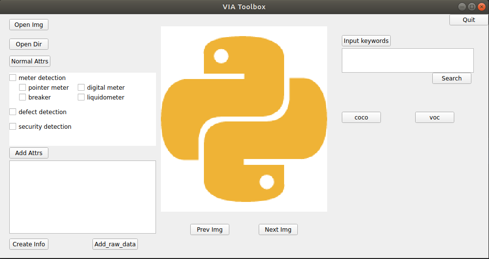

# VIA Toolbox



This software helps to generate COCO or VOC format dataset using annotations labeled
with [VGG Image Annotator (VIA)](https://www.robots.ox.ac.uk/~vgg/software/via/) version 2.

# Install

```
git clone https://github.com/DrawZeroPoint/via_toolbox

# Optional
pip install -r requirement.txt
cd PythonAPI
python setup.py build develop
```

# Usage

### Before using the APP

1. Create a `Database` folder in your `/home/<username>` path.

2. Run app.py

### Convert the VIA annotation file to COCO format

1. First, use VIA to label the dataset. Each instance of interest should be labeled with a bounding box.
   Inside the bbox, arbitrary keypoints could be labeled. The attribute indicates the visibility. By 
   default, all keypoints should have visibility=2, i.e., visible.
   
2. Run the toolbox App or directly run [coco/coco_multi_obj.py](coco/coco_multi_obj.py). In the app, click
   the `coco` button on the right hand side, then in the sub panel, choose the image dir and the path to the
   `.json` file generated by VIA, then convert. The COCO format annotation file will be output to the same folder
   as the original annotation.
